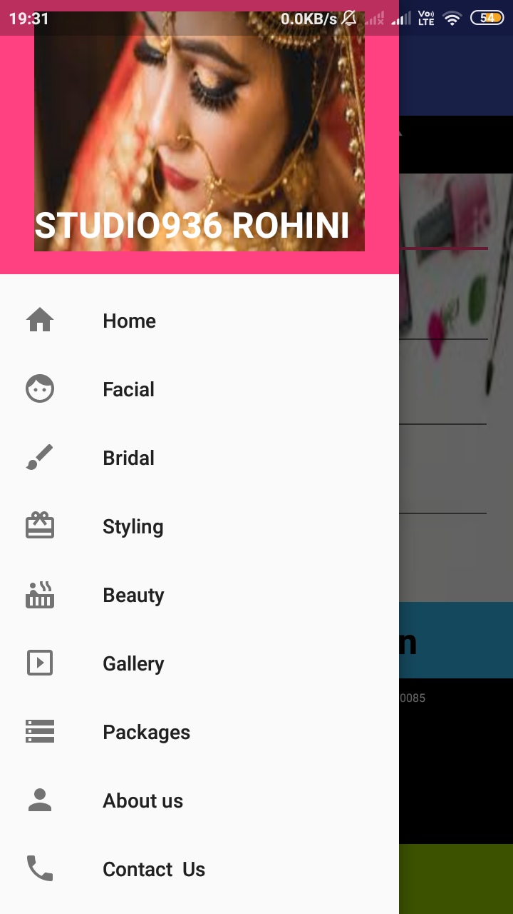
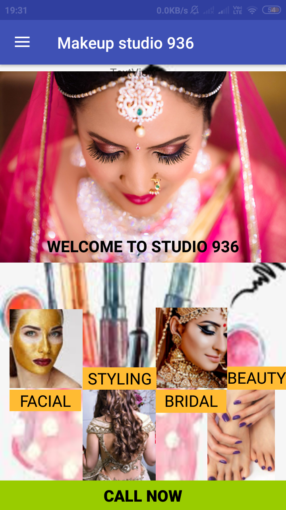
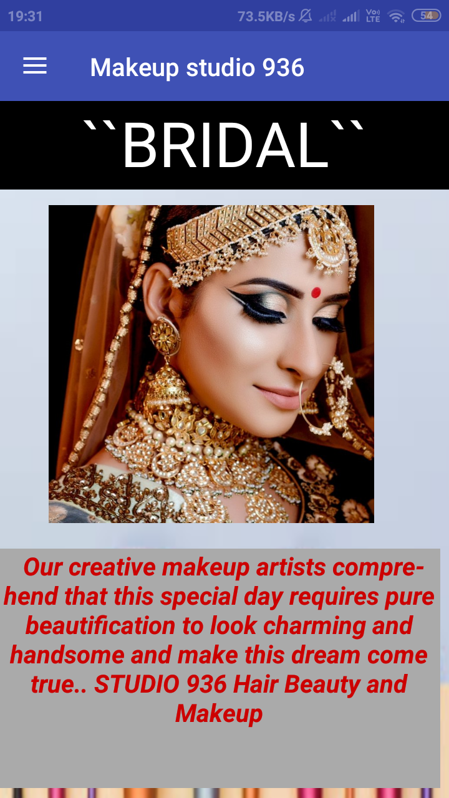
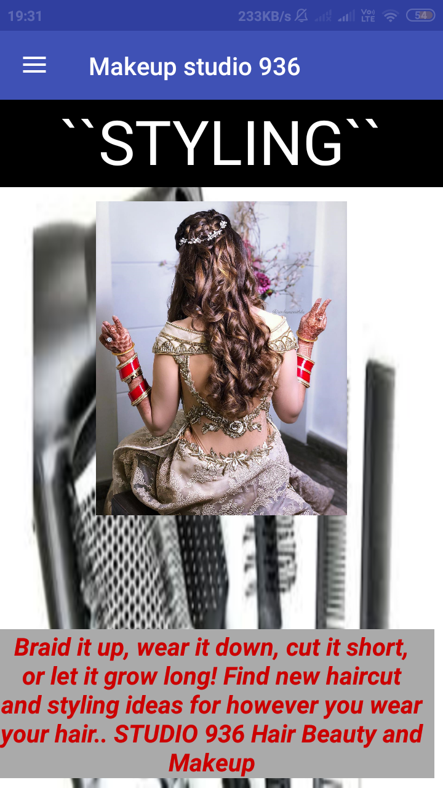
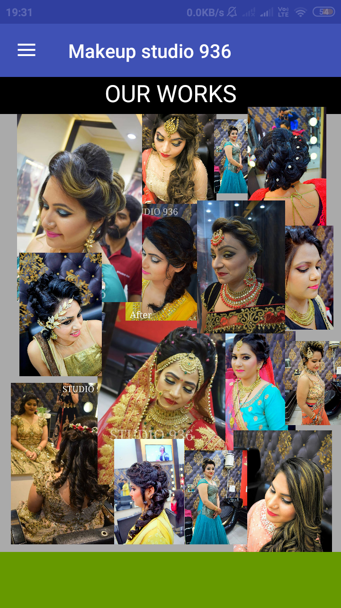
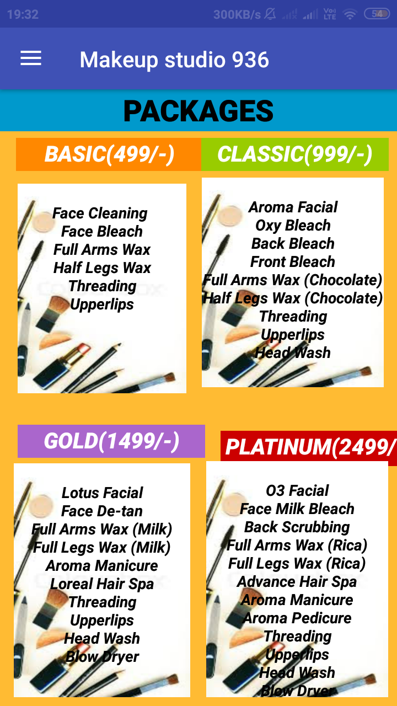
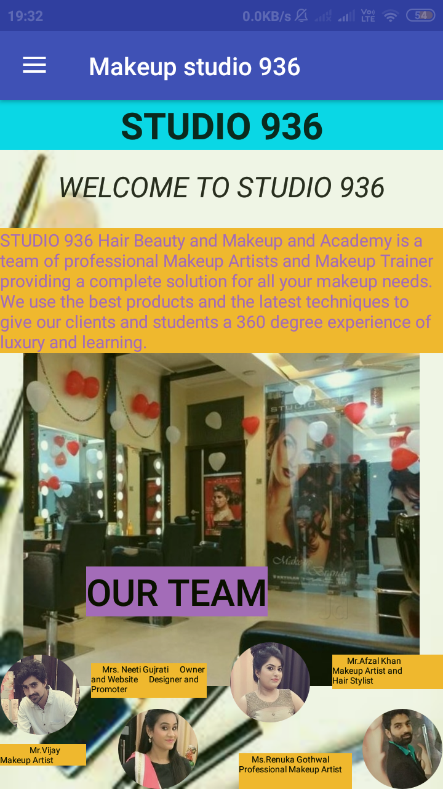
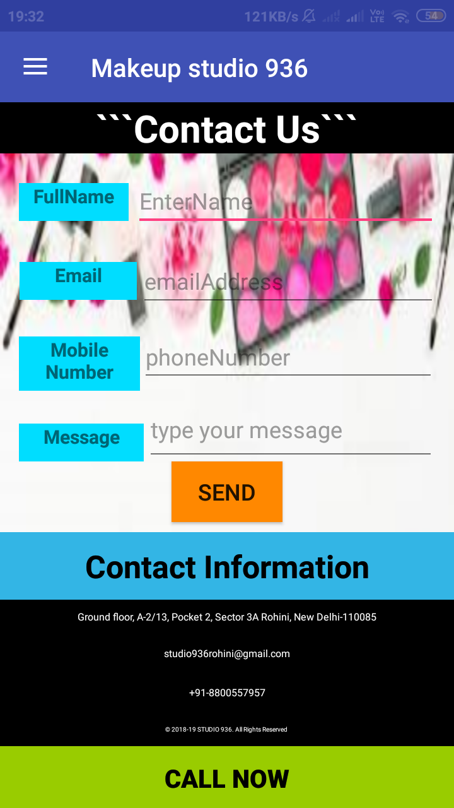

# BeautySalon-Application
This is an application for a makeup studio center which showcases 
<ul>
  <li>services</li>
  <li>packages</li>
  <li>Previous works</li>
  <li>Charges</li>
  <li>staff</li>
  <li>location</li>
  <li>contact details</li>
  <li>booking details</li>
  <li>offers</li>
  <li>appointment options</li>
  <li>queries and confirmations</li>
  </ul>
  
 # Application Insight
 The application is very easy to use , developed in accordance to the background of targeting audience., A navigation drawer collects all information at single page , making it easy to access. Entire application is divided into fragments . Users have the facility to call the reception of studio directly from app itself. Users may send queries , appointment bookings and messages via email facility.
 
 # Snapshots
 
 
  
  
 
  
  
 
  
  
 
  
  
 
  
  
 
  
  
 
  
  
 
  
  
 
 
